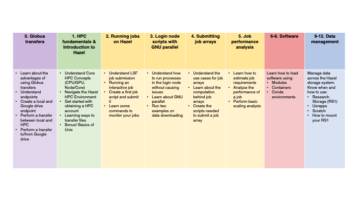
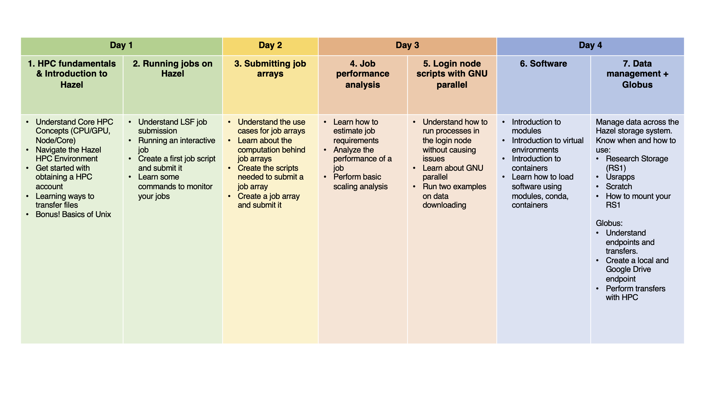

# BRC Hazel Training Materials

This repository contains training materials in Quarto markdown format (`.qmd` files) to learn how to use Hazel HPC for bioinformatics.

These materials were developed by the Hurwitz Lab at North Carolina State University as part of the Bioinformatics Resource Center (BRC) training program. They accompanied live workshop sessions but can also be used for self-paced learning.

The workshop presentations can be found int he `slides/` directory, while hands-on exercises and tutorials are in the `notebooks/` directory.

This is table depicting the calendar of live training sessions associated with these materials. We recommend you follow along with the exercises in the order presented here:

Semester-long workshop: 



Week-long workshop: 


## 🚀 Getting Started

1. Clone or download this repository
2. Choose your preferred viewing method from the options below
3. Open the training materials and follow along with the exercises


## 👀 Viewing the Training Materials

There are several ways to view and interact with the training materials:

### Option 1: View Pre-rendered HTML Files (Easiest)

1. Download the HTML files from the repository
2. Open them directly in your web browser
3. No additional software required

### Option 2: Use VS Code with Quarto Extension (Recommended for Editing)

If you want to edit or preview the materials while working on them:

1. Install [VS Code](https://code.visualstudio.com/)
2. Install the [Quarto extension](https://marketplace.visualstudio.com/items?itemName=quarto.quarto) for VS Code
3. Open the `.qmd` files in VS Code
4. Use the preview pane to see rendered output alongside your code
5. Press `Ctrl+Shift+K` (or `Cmd+Shift+K` on Mac) to render the document

### Option 3: Render with Quarto CLI

To render the Quarto documents yourself:

1. Install [Quarto](https://quarto.org/docs/get-started/)
2. Clone this repository:
   ```bash
   git clone https://github.com/hurwitzlab/brc_hazel_training.git
   cd brc_hazel_training
   ```
3. Render individual documents:
   ```bash
   quarto render document.qmd
   ```
4. Or render all documents:
   ```bash
   quarto render
   ```
5. Open the generated HTML files in your browser

### Option 4: Use RStudio

If you're familiar with RStudio:

1. Install [RStudio](https://posit.co/download/rstudio-desktop/) (version 2022.07 or later includes Quarto)
2. Open the `.qmd` files in RStudio
3. Click the "Render" button to preview documents

### Option 5: View raw files on GitHub

You can view the raw Quarto markdown files directly on GitHub, though formatting and code output won't be rendered.

---

## 🤝 Contributing

If you find issues or have suggestions for improvements, please open an issue or submit a pull request.


## 📧 Contact

For questions about the training materials, please contact the Hurwitz Lab (mtouced@ncsu.edu or blhurwit@ncsu.edu)
