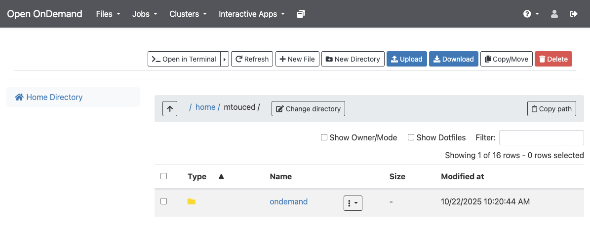

# BRC Documentation: Introduction to Hazel-HPC 

## 01. First steps in Hazel HPC

## Set up an account

Request access from your supervisor and in the mean time read and understand [Acceptable Use Policy](https://hpc.ncsu.edu/About/AUP.php). Obtain your UnityID credentials and ensure you have VPN access if working off-campus.

---

## Log in
1. **Web browser** (OnDemand): <https://servood.hpc.ncsu.edu>
2. **Terminal**: To connect to the shared HPC login nodes, open a terminal window and type 
```bash
ssh [UnityID]@login.hpc.ncsu.edu
```
where user_name is the Unity ID. 


> *To allow Hazel to open a window on a local machine, e.g., for GUI applications, X11 forwarding must be enabled by adding the -X option (i.e. ssh -X user_name@login.hpc.ncsu.edu). On macOS, install XQuartz to use X11 forwarding. When using MobaXterm, X11 is enabled by default.*

3. **VSCode**: <https://hpc.ncsu.edu/Documents/LoginUsingVSCode.php>

---

## Transfer files

### OnDemand
 Go to [OnDemand](https://servood.hpc.ncsu.edu)

- Under **`Files`**, using the **`Upload`** or **`Download`** buttons to transfer. Make sure you navigate to the destination/source directory on cluster using the **`Go To`** button before transferring files.

{fig-align="center"}


### SCP
For transferring a single file in one direction. 
Open a terminal on your local machine, and without login into the HPC do: 
```bash
# Local to HPC
$ scp filename [UnityID]@login.hpc.ncsu.edu:/rs1/researchers/[letter]/[name] local/path/to/stuff

# HPC to local
$ scp [UnityID]@login.hpc.ncsu.edu:/rs1/researchers/[letter]/[name] local/path/to/stuff
```

### SFTP
To transfer multiple files or in multiple directions (local to HPC and viceversa) without needing to re-authenticate, or to be able to navigate the remote file system. 
From the local machine initiate an SFTP session: 
```bash
$ sftp [UnityID]@login.hpc.ncsu.edu
```

At the prompt do: 
```bash
sftp> cd /path/to/stuff
sftp> put filename
sftp> get filename
```

### Globus
Globus is a point to point file syncing platform. It is very useful for transfering large files or large numbers of small files, since it allows for bacground scheduled transfers. See our <span style="color:purple;">**Globus-ncsu tutorial**</span> to learn more about Globus and how to use it with the NCSU Hazel HPC. 

---

## Useful commands

### System and user info
* Check queues you have access to: `$ bqueues -u [UnityID]`
* Check the groups you belong to (first one is your default): `$ groups`
* To see what node you are in: `$ hostname` or `$ echo $HOSTNAME`

### Storage
* Check size of the directory you are in: `$ du -sh .`
> Important for checking pipeline output size 
* Check size of files in a directory: `$ du -sh [pathtodirectory]/*`
* Check how much space is being used in your home directory: `$ quota`
* Check space allocations for your group: `$ quota -s -g group_name`
* Check files in reversed time order (most recently modified at the end): `$ ls -lrt`

### Software and resource info
* Find available modules: `$ module avail`
* Find path to executable: `$ wich [executablename]`

---

## Resources
* Getting started on Hazel: <https://hpc.ncsu.edu/Documents/GetStarted.php>
* Cluster status: <https://hpc.ncsu.edu/Monitor/ClusterStatusMemory.php>
* Support: **oit_hpc@help.ncsu.edu**
* HPC-Henry2 moodle course on Reporter: <https://moodle-projects.wolfware.ncsu.edu/course/view.php?id=6857> 
* Youtube channel for OIT with tutorial videos: <https://www.youtube.com/@OITHPC> 
* To stay informed about Hazel-HPC news join the **HPC Announcements Google Group**

---

## Your First Week on Hazel HPC
### Before You Start:

 - [ ] Obtain your UnityID credentials and VPN access (if off-campus)
 - [ ] Join your research group's allocation/project space
 - [ ] Review this documentation and bookmark it for reference

### Getting Connected:

 - [ ] SSH into the login node: `ssh [UnityID]@hazel.ncsu.edu`
 - [ ] Explore your home directory (`/home/[UnityID]`) - remember, only 1GB available!
 - [ ] Locate your group's scratch space 
 - [ ] Find your group's RS1 storage 