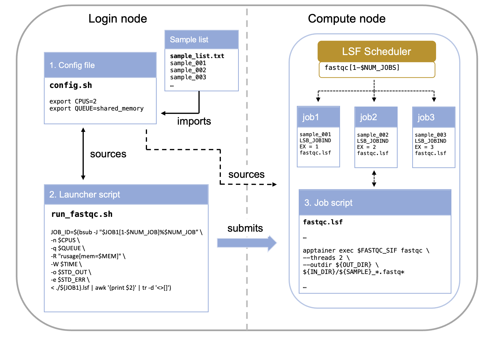

# 04. Scaling Up: Running Parallel Jobs with Job Arrays

When you have hundreds of independent tasks—like processing a long list of sequencing samples—submitting them one by one is inefficient. A **Job Array** allows you to submit one job to the scheduler, which then launches many instances (sub-jobs) concurrently, each tailored to process a different item.

::: {.callout-note}
## Why Use Job Arrays?
- **Efficiency**: Submit once, run many times
- **Resource Management**: Control concurrent execution
- **Simplified Tracking**: One parent job ID for all tasks
- **Scalability**: Easily process 10 or 1,000 samples
:::


<br>

## The Core Concept: The Job Index

The key to a Job Array is the environment variable that the scheduler automatically sets for each sub-job: **`$LSB_JOBINDEX`**.

* **`$LSB_JOBID`**: The unique ID for the entire array (the parent job)
* **`$LSB_JOBINDEX`**: The index number for each individual sub-job (e.g., 1, 2, 3...)
* **Array ID Format**: When running, a sub-job's ID appears as `JOBID[JOBINDEX]`, e.g., `12345[1]`, `12345[2]`, etc.

::: {.callout-tip}
## Understanding the Index
If you submit an array with `#BSUB -J "myjob[1-100]"`, LSF will create 100 sub-jobs. The first will have `$LSB_JOBINDEX=1`, the second `$LSB_JOBINDEX=2`, and so on through 100.
:::


<br>

## Anatomy of the Array System

Running a Job Array typically involves two primary scripts working together:

1.  **The Config File**: Stores environmental variables and paths
2.  **The Launcher Script**: Submits the job to LSF and defines the array size
3.  **The Job Script**: Uses `$LSB_JOBINDEX` to select and process a single item



### Component 1: The Config File (`config.sh`)

The config file centralizes all variable elements of your pipeline, making it easy to modify parameters without editing multiple scripts.

**What belongs in the config file:**

- **File paths** (input lists, output directories)
- **Resource requirements** (CPUs, memory, time limits)
- **Software parameters** (trimming thresholds, quality cutoffs)
- **Job names and dependencies**

```bash
export ID=MY_ID
export IN_LIST="/your/path/to/repo/sample_list.txt"  
export IN_DIR="/path/to/raw_reads"                 
export FASTQC_SIF="/path/to/container/image"                                           

# Create output directory if it doesn't exist
mkdir -p /path/to/working/dir/01_raw_fastqc_results
export OUT_DIR="/path/to/working/dir/01_raw_fastqc_results"
```

::: {.callout-warning}
## Path Validation
Always validate that critical files exist before launching jobs. This prevents wasting compute time on jobs that will fail immediately.
:::


### Component 2: The Launcher Script (`run_fastqc.sh`)

This script runs on the **login node** and orchestrates job submission.

```bash
$ ./run_fastqc.sh
```

Its primary function is to calculate the total number of tasks needed and submit the array definition using the `bsub -J` directive.

```bash
#! /bin/bash

# load job configuration
source ./config.sh


# make sure sample file is in the right place
if [[ ! -f "$IN_LIST" ]]; then
    echo "$IN_LIST does not exist. Please provide the path for a list of datasets to process. Job terminated."
    exit 1
fi

# create a variable with the job name
export JOB1="fastqc"  # this is not necessary but will be useful for consistency in larger pipelines

# get number of samples to process
# the number of samples will be used to set the range of the job array
export NUM_JOB=$(wc -l < "$IN_LIST")

# submit job arrays for each step
echo "launching ${JOB1}.lsf as a job."
JOB_ID=`bsub -J "$JOB1[1-$NUM_JOB]%$NUM_JOB" < ${JOB1}.lsf`
```

- `source ./config.sh`	Loads parameters (like the list of samples) from a separate configuration file.
- `$(wc -l < "$IN_LIST")`	Calculates the number of tasks required (the end index of the array).
- `-J "$JOB1[1-$NUM_JOB]%$NUM_JOB"`: Array syntax with optional concurrency limit

| Component | Example Value | Description |
| :--- | :--- | :--- |
| $JOB1 | `fastqc` | This is the **base name** for the job array. Individual sub-jobs will be named, for example, `fastqc[1]`, `fastqc[2]`, etc. |
| [1-\$NUM\_JOB] | e.g., `[1-50]` | This defines the **range** of the job array. It means the array will consist of sub-jobs with indices starting from **1** up to the value of $NUM\_JOB (which is the number of lines in your input file). Each sub-job will process one line/sample. |
| %\$NUM\_JOB | e.g., `%50` | This is the crucial **concurrency limit**. It specifies the **maximum number of sub-jobs** from this array that LSF is allowed to run **at the same time** (concurrently). |

::: {.callout-tip}
## Concurrency Limits
The `%N` syntax prevents overwhelming the filesystem or scheduler. For large arrays (>100 jobs), consider limiting to 20-50 concurrent jobs.
:::


### Component 3: The Job Script (`fastqc.lsf`)
This script contains the actual work to be performed on the compute nodes.

```bash
# fastqc.lsf - Job script for FastQC analysis
# --------------------------------------------------
# Request resources here
# --------------------------------------------------
#BSUB -n 2                            # number of CPUs required per task
#BSUB -q shared_memory                # the queue to run on
#BSUB -R "span[hosts=1]"              # number of hosts to spread the jobs across, 1 host used here
#BSUB -R "rusage[mem=4GB]"            # required total memory for the job 
#BSUB -o "./output.%J_%I.log"         # standard output file (%J is job name)
#BSUB -e "./error.%J_%I.log"          # standard error file (%I is job ID)
#BSUB -W 10:00                        # time to run

# --------------------------------------------------
# Load modules here
# --------------------------------------------------

module load apptainer

# --------------------------------------------------
# Execute commands here
# --------------------------------------------------

# Print job start information
echo "=================================================="
echo "Job started: $(date)"
echo "Job ID: $LSB_JOBID"
echo "Running on host: $(hostname)"
echo "Working directory: $(pwd)"
echo "=================================================="

# Source config file and get sample name from input list based on job array index
source ./config.sh
export SAMPLE=`head -n +${LSB_JOBINDEX} $IN_LIST | tail -n 1`


# --------------------------------------------------
# Validate inputs
# --------------------------------------------------

# Check if container exists
if [ ! -f "${FASTQC_SIF}" ]; then
    echo "ERROR: Container not found at ${FASTQC_SIF}"
    exit 1
fi

# Check if input directory exists
if [ ! -d "${IN_DIR}" ]; then
    echo "ERROR: Input directory not found at ${IN_DIR}"
    exit 1
fi

# --------------------------------------------------
# Execute FastQC
# --------------------------------------------------

echo "Running FastQC on sample: ${SAMPLE}"

apptainer exec ${FASTQC_SIF} fastqc \
    --threads 2 \
    --outdir ${OUT_DIR} \
    ${IN_DIR}/${SAMPLE}_*.fastq*

# Check if FastQC completed successfully
if [ $? -eq 0 ]; then
    echo "FastQC completed successfully"
else
    echo "ERROR: FastQC failed with exit code $?"
    exit 1
fi

# --------------------------------------------------
# Job completion
# --------------------------------------------------

echo "=================================================="
echo "Job completed: $(date)"
echo "Results saved to: ${OUT_DIR}"
echo "=================================================="
```
**Critical concept**: The line `export SAMPLE=head -n +${LSB_JOBINDEX $IN_LIST | tail -n 1` is what makes each sub-job unique. It extracts the Nth line from your sample list, where N is the job index.

::: {.callout-important}
## The Magic of `$LSB_JOBINDEX`
- Job 1 gets line 1: `sample_001`
- Job 2 gets line 2: `sample_002`
- Job 3 gets line 3: `sample_003`

This allows one script to process all samples!
:::

<br>

## Resource Specification: Three Approaches

There are multiple ways to specify compute resources. Up to now we have been **"hardcoding"** (typing the exact value) the resource request in the job script. While the simplest method, this is however not the recommended one. It is commonly accepted as best practice to **only modify the config file** when adapting a pipeline. In that case, we would want to create the necessary variables in the config file and then pass them to the job via the launcer. Let's see how this works.


### Approach 1: Hardcoded in Job Script (Simplest)
This is the approach we have been using so far in this training. 
```bash
# --------------------------------------------------
# Request resources here
# --------------------------------------------------
#BSUB -n 2                            # number of CPUs required per task
#BSUB -q shared_memory                # the queue to run on
#BSUB -R "span[hosts=1]"              # number of hosts to spread the jobs across, 1 host used here
#BSUB -R "rusage[mem=4GB]"            # required total memory for the job 
#BSUB -o "./output.%J_%I.log"         # standard output file (%J is job name)
#BSUB -e "./error.%J_%I.log"          # standard error file (%I is job ID)
#BSUB -W 10:00 
```

- **Pros**: Simple, self-contained
- **Cons**: Must edit job script to change resources


### Approach 2: Command-Line Specification (Recommended)
Here we first want to create the variables and populate them (give them values) in the `config.sh` file. 

**`config.sh`:**
```bash
# --- Job Parameters ---
export JOB3="03_fastqc_before"
export QUEUE="shared_memory"
# 03 FastQC Before Trim
export CPUS=1
export QUEUE="${QUEUE}"
export MEMORY="1GB"
export TIME="02:00"
```

This allows us to skip the `#BSUB` directives entirely in your `.lsf` file and **pass all resource requests directly to the bsub command in your launcher script**. This is useful for pipelines where one launcher controls many different job scripts.

The command to launch the job changes from this: 
```bash
# submit job arrays for each step
echo "launching ${JOB1}.lsf as a job."
JOB_ID=`bsub -J "$JOB1[1-$NUM_JOB]%$NUM_JOB" < ${JOB1}.lsf`
```

To this: 
```bash
# submit job arrays for each step
echo "launching ${JOB1}.lsf as a job."
JOB_ID=$(bsub -J "$JOB1[1-$NUM_JOB]%$NUM_JOB" \
      -n $CPUS \
      -q $QUEUE \
      -R "rusage[mem=$MEM]" \
      -W $TIME \
      -o $STD_OUT \
      -e $STD_ERR \
      < ./${JOB1}.lsf | awk '{print $2}' | tr -d '<>[]')
```

- **Pros**: Complete control from launcher, no #BSUB directives needed
- **Cons**: Longer bsub commands, all jobs use same resources

::: {.callout-tip}
## Best Practice
**We recommend you use Approach 2** (variables from config) for most pipelines. It provides the best balance of flexibility and maintainability. In fact this is what we have used in the **example code**. See: `brc_hazel_training/scripts`
:::


<br>

## Advanced Topics (⚠️ This hasn't been tested)

### Non-Sequential Arrays
```bash
# Skip certain indices
bsub -J "myjob[1-100:2]"  # Only odd numbers: 1,3,5...99
bsub -J "myjob[10,20,30,40]"  # Specific indices only
```

### Job Dependencies
```bash
# Wait for array to complete before starting next job
JOB1_ID=$(bsub -J "step1[1-100]" < step1.lsf)
JOB2_ID=$(bsub -w "done(step1)" < step2.lsf)
```

### Resubmitting Failed Jobs
```bash
# If jobs 5, 12, and 23 failed
bsub -J "myjob[5,12,23]" < myjob.lsf
```


## Questions 
- How to tell (properly) which job inside the array has failed
- What really is this: `"$JOB1[1-$NUM_JOB]%$NUM_JOB"`
- make a schematic figure of the config-job script-launcher

