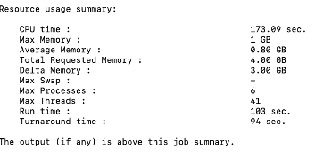

## Training Objectives

By the end of this session, you will be able to:

::: {.incremental}
- Estimate computational resource requirements for jobs
- Monitor and analyze job performance on Hazel
- Conduct basic scaling analysis to optimize resource usage
- Identify performance bottlenecks and inefficiencies
:::

# Part 1: Estimating Job Requirements 

## Why Estimate Resources?

**Underestimation:**

- Jobs fail or timeout
- Wasted computational time
- Need to resubmit

**Overestimation:**

- Longer queue times
- Wasted cluster resources
- Reduced fair share priority

::: {.callout-tip}
Better estimates = faster completion + efficient resource use
:::

## Key Resources to Estimate

| Resource | Question to Ask |
|----------|----------------|
| **Cores** | Is this parallel? How many can it use effectively? |
| **Memory** | What's the dataset size? Algorithm requirements? |
| **Time** | How long for a test case? How does it scale? |
| **Storage** | Input/output file sizes? Temporary files? |

::: {.callout-note}
## Remember
Memory = RAM used during computation (temporary, in-node)
Storage = Disk space for input/output files (persistent)
:::

## Estimating Cores

**Start with the application:**

::: {.incremental}
- Serial code → 1 core
- OpenMP/threaded → typically 8-16 cores on one node
- MPI → can span multiple nodes, test scaling
- Hybrid MPI+OpenMP → combination approach
:::

**Rule of thumb:** Start small, measure, then scale up

::: {.callout-tip}
## Hazel Node Types
Hazel nodes vary in CPU generation and core count. For shared-memory parallel jobs, keep all tasks on a single node to avoid inter-node communication overhead. Use `--nodes=1` in your job script to enforce this.
:::

## Estimating Memory

**Quick estimation methods:**

1. **Documentation:** Check software requirements
2. **Similar jobs:** Look at past jobs in your group
3. **Test runs:** Run small version, check actual usage with `bjobs -l`
4. **Data-driven:** Estimate based on your input data structure:
   - If the code reads input as a matrix and makes copies: memory ≈ **N × file size** (where N = number of matrix copies held simultaneously)
   - Number of grid points × number of variables × size of data type

::: {.callout-warning}
## Hazel Node Memory Sizes
Hazel nodes have the following memory configurations (in GB):

`64 / 128 / 192 / 256 / 512* / 1024**`

\* Higher memory nodes are limited outside of partner queues.
\*\* Very few nodes; may not be available in every partition and will incur longer wait times.

**Important:** Request memory slightly below the node maximum — OS processes also consume RAM. For example, to target a 128 GB node, request `--mem=120G`.
:::

## Estimating Wall Time

**Strategies:**

1. Run a small test problem
```{.bash}
# Run test
bsub -W 0:30 -n 4 ./test_run

# Check how long it took
bjobs -l JOBID | grep "CPU time"
```

**Then extrapolate:**

- Linear scaling: 2x data ≈ 2x time
- Worse than linear: iterative algorithms, complex I/O
- Consider adding 20-30% buffer

---
<br>

# Part 2: Analyzing Job Performance

## Monitoring Running Jobs

**Basic monitoring:**

```{.bash}
# Check your jobs
bjobs

# Detailed information
bjobs -l JOBID

# Check specific queue
bqueues shared_memory

# Why is my job pending?
bjobs -p JOBID
```

## Understanding Job Status

```{.bash}
JOBID   USER    STAT  QUEUE      FROM_HOST   EXEC_HOST   JOB_NAME
123456  user01  RUN   shared_mem login01     node042     analysis
123457  user01  PEND  medium     login01     -           bigrun
```

**Key states:**

- **RUN** - Currently executing
- **PEND** - Waiting in queue
- **DONE** - Completed successfully
- **EXIT** - Failed

## Pending Job Analysis

**Common reasons jobs wait:**

```{.bash}
bjobs -p JOBID
```

Typical outputs:

- "Not enough processors" - cluster at capacity
- "User has reached job limit"
- "Queue has reached job limit"
- "Resource requirements not satisfied"

## Actual vs Requested Resources

**Check what was actually used:**

```{.bash}
bjobs -l JOBID | grep -A 5 "CPU time"
```

Look for:

- **CPU utilization** - Were cores actually busy?
- **Memory usage** - Did you request too much/little?
- **Run time** - Did it finish early or timeout?

## Performance Red Flags

::: {.columns}
::: {.column width="50%"}
**Inefficient Usage**

- Requested 16 cores, used 2
- 128GB RAM requested, 8GB used
- Job finished in 10 min, requested 24 hrs
:::

::: {.column width="50%"}
**Resource Issues**

- Job killed for exceeding memory
- Timeout before completion
- High I/O wait times
- Swapping to disk
:::
:::

Note that LSF outputs some job performance information at the end of the SDOUT. This resource usage summary is a standard output from IBM Spectrum LSF (Load Sharing Facility). It provides a post-job analysis of how efficiently your task used the hardware resources it was allocated.

Here is a breakdown of what each metric means using the example of our `fastqc.lsf` job:



**Memory Utilization:** 

- Max Memory (1 GB): The peak amount of physical RAM (resident set size) your job used at any single point during its execution.
- Average Memory (0.80 GB): The mean memory usage over the entire duration of the job.
- Total Requested Memory (4.00 GB): The amount of RAM you specifically asked for in your submission script (e.g., via `#BSUB -R "rusage[mem=4000]"`).
- Delta Memory (3.00 GB): The difference between what you requested and what you actually used. 
  - Observation: We over-requested memory by 3 GB. In a shared cluster, reducing your request to 1.5 GB or 2 GB would help your jobs start faster and be more "neighborly" to other users.
- Max Swap (-): The maximum amount of swap space (disk-based virtual memory) used. A dash usually means zero swap was used, which is good for performance.

**Processing & Parallelism:** 

- CPU time (173.09 sec): The total time spent by all CPU cores executing your job's instructions.
- Max Processes (6): The peak number of simultaneous processes created by your job.
- Max Threads (41): The peak number of simultaneous threads running within those processes.

**Time Metrics:**

- Run time (103 sec): The "wall clock" time. This is the actual time that passed from the moment the job started until it finished.
  - Note: Since our CPU time (173s) is higher than your Run time (103s), it confirms our job was multi-threaded or multi-process, utilizing more than one core's worth of processing power.

- Turnaround time (94 sec): This usually represents the time from when the job was dispatched to when it finished.
  - Note: In some LSF configurations, if Turnaround is shorter than Run time, it may indicate how LSF tracks the cleanup phase or specific reporting intervals, but generally, these two will be very close.

## Exercise 1: Analyzing a Job

```{.bash}
# Submit a test job
bsub -n 4 -W 0:10 ./test_program

# Get job ID and monitor
bjobs

# After completion, check performance
bjobs -l JOBID > job_analysis.txt

# Look at the output
less job_analysis.txt
```


**Analyze and identify:**

1. Was the resource request appropriate?
2. What would you change for the next run?
3. Any red flags or issues?


## Hazel-Specific Considerations

**Node characteristics:**

- Nodes are heterogeneous (different CPU generations)
- Shared vs exclusive node access matters
- Network topology affects MPI jobs
- Memory per core varies by node type

**Best practice:** Use `-R "span[hosts=1]"` for shared memory to avoid communication penalties


# Putting It All Together 

## Workflow for Job Optimization

1. **Start small:** Test with minimal resources
2. **Measure:** Collect actual performance data
3. **Analyze:** Check utilization and identify bottlenecks
4. **Scale:** Run controlled scaling experiments
5. **Optimize:** Choose resource configuration that balances time and cost
6. **Document:** Record optimal settings for future runs

## Common Patterns

**CPU-bound jobs:**

- Scale well with cores (up to a point)
- Memory not a limiting factor
- Focus on finding optimal core count

**Memory-bound jobs:**

- Limited by available RAM
- May need fewer cores per node
- Consider high-memory nodes

**I/O-bound jobs:**

- Don't scale well with cores
- Focus on minimizing file operations
- Use `/share/scratch` effectively

## Practical Tips

::: {.incremental}
- **Start testing with short runs** - use subsets of data
- **Check job output files** - they contain valuable timing info
- **Compare similar jobs** - learn from past successes
- **Don't over-optimize** - 80/20 rule applies
- **Share findings** - help your research group
:::
