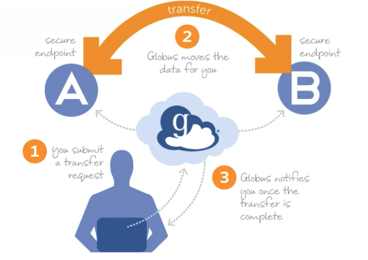
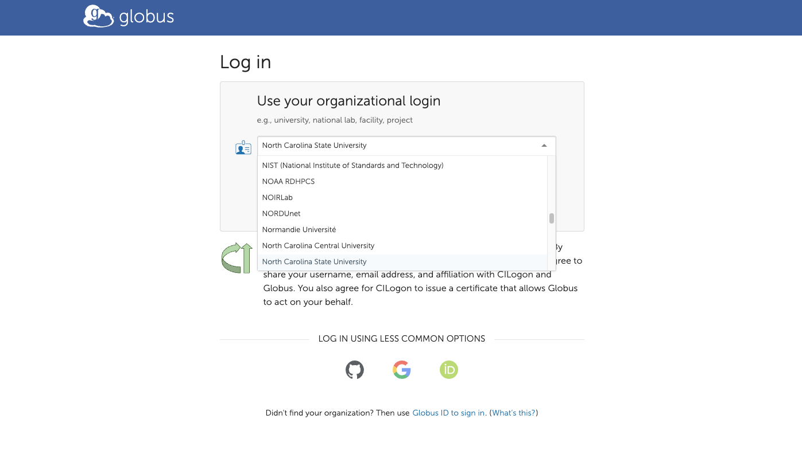
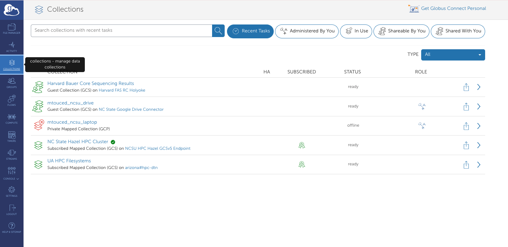
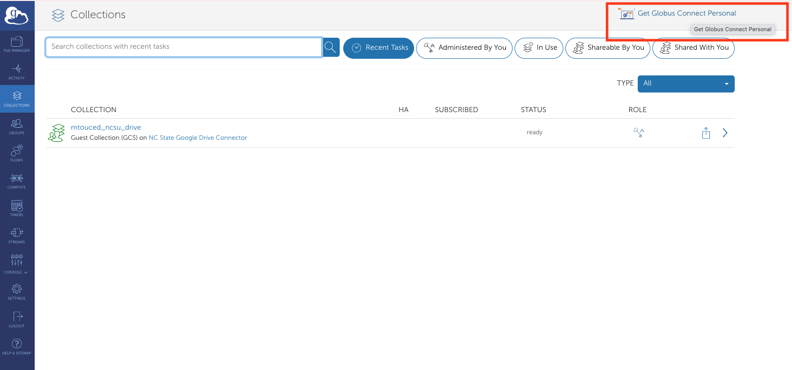
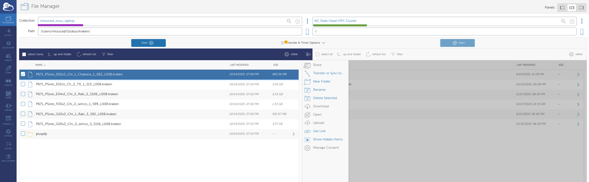
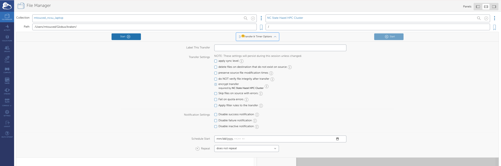
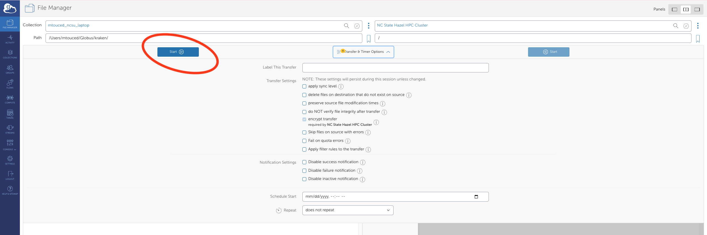
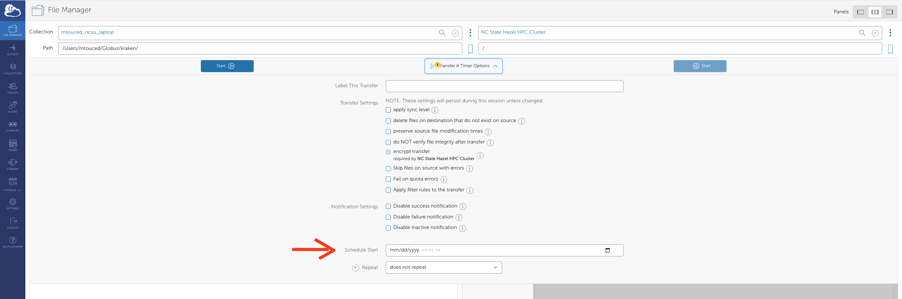
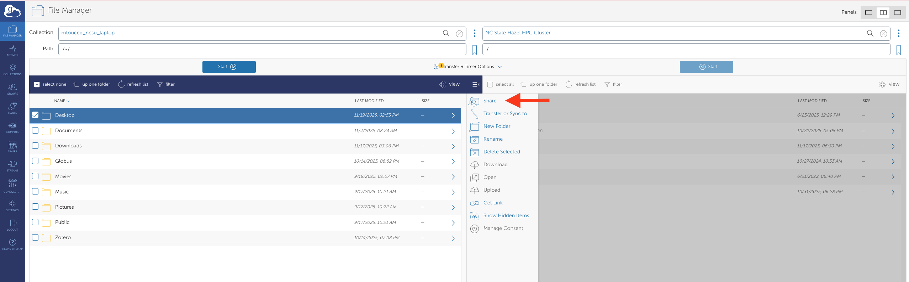
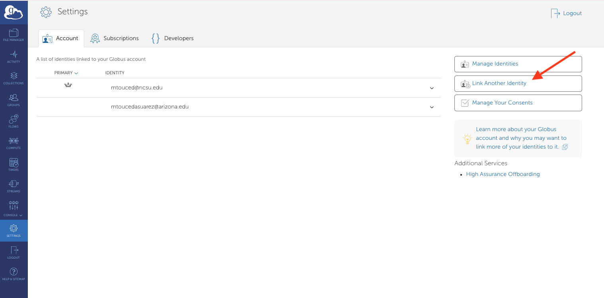

## Overview

Globus is a secure, point-to-point file synchronization platform that orchestrates data transfers between endpoints. Unlike traditional file transfer methods, data never traverses through Globus servers—instead, Globus facilitates end-to-end encrypted communication between endpoints, allowing them to transfer files directly.

{fig-align="center"}

## Key Terminology
**Collection**
: A named set of files and folders that can be accessed through Globus

**Endpoint**
: A computer or server that hosts files and can send or receive data via Globus

**Globus Connect Server**
: Infrastructure deployed in front of storage platforms (e.g., Google Drive, research storage, HPC systems) to enable Globus transfers

**Globus Connect Personal**
: A desktop application that transforms your local machine into a Globus endpoint for data transfers

**Globus Plus**
: An enhanced subscription that provides additional features, including the ability to synchronize multiple endpoints and share data with external collaborators

## Why Use Globus?

Globus offers several advantages over traditional file transfer methods:

- **Reliability**: Automatic retry and resume capabilities for interrupted transfers
- **Speed**: Optimized for high-performance transfers, especially for large datasets
- **Convenience**: Transfers continue in the background; no need to keep your browser open
- **Security**: End-to-end encryption and authentication through institutional credentials
- **Scalability**: Efficiently handles transfers from single files to millions of files
- **Sharing**: Easy and secure data sharing with collaborators at other institutions

::: {.callout-note}
## When to Use Globus
Globus is particularly useful for:

- Transferring large datasets (>1 GB)
- Moving data to/from HPC systems
- Sharing data with external collaborators
- Automated/scheduled transfers
- Transfers with many small files

For quick transfers of small files (<100 MB), traditional methods may be simpler.
:::


## Getting Started

### Prerequisites

Before you begin, ensure you have:

- Active NCSU credentials (Unity ID and password)
- Access to the systems you want to transfer data between
- A modern web browser (Chrome, Firefox, Safari, or Edge)

### Creating a Globus Account

1. Navigate to [https://www.globus.org](https://www.globus.org)
2. Click **Log In** in the top right corner
3. Search for "North Carolina State University" in the organization list
4. Click **Continue** and authenticate with your NCSU credentials
5. Complete any first-time setup prompts

{fig-align="center" width="70%"}

::: {.callout-warning}
In my experience some of the first-time setup promts might take a couple of trys, you might need to refresh the page and do it again one of two times before it works
:::


## Connecting Your NCSU Google Drive 
Follow these steps to make your NCSU Google Drive accessible through Globus:

1. Navigate to **Collections** on the [Globus website](https://www.globus.org)
{fig-align="center" width="70%"}

2. Search for `ncsu google` in the search bar
3. Locate and click on **NC State Google Drive Connector**
4. Click **Collections** in the top menu
   - You may be prompted to grant permissions to Globus at this point
5. Click the **Add Guest Collection** button (top right)
   - A popup will appear requesting your NCSU credentials
6. Configure your collection:
   - Select the directory you want to share
   - Enter a memorable **Display Name** (e.g., "My Research Data 2024")
   - Use the **Description** field to add details about the collection's contents
7. Click **Create Collection** and authorize in the popup window

::: {.callout-tip}
Choose descriptive collection names that clearly indicate what data they contain. This will help you and collaborators quickly identify the correct collection during transfers.
:::


## Conencting Your Local Machine
To transfer files to/from your personal computer, you'll need to install Globus Connect Personal.

::: {.callout-note}
For a second set of instructions, see the [University of Arizona HPC Globus guide](https://hpcdocs.hpc.arizona.edu/storage_and_transfers/transfers/globus/#globus-connect-personal).
:::

1. Download **Globus Connect Personal** from the Collections page (link in top right corner)

{fig-align="center" width="70%"}

2. Install and launch the application
3. Log in using your NCSU credentials
   - Authentication occurs via a browser popup
4. Create a label for your local machine (e.g., "Meri-Laptop" or "Lab-Workstation")
5. Enter your preferred **Display Name** for this endpoint and click **Save**

Your local machine is now configured as a Globus endpoint and will appear under **Collections**.


## Transferring Files

Once you have at least two collections set up, you can initiate transfers:

1. In the **File Manager**, select your [**source collection**]{style="color:purple"} (left panel) and [**destination collection**]{style="color:green"} (right panel)

{fig-align="center" width="70%"}

2. Navigate to and select the file(s) or folder(s) you want to transfer
3. Configure **Transfer & Timer Options**:
   - Sync options (sync only new/changed files)
   - Transfer label for tracking
   - Email notifications

{fig-align="center" width="70%"}

4. Click **Start** to begin the transfer

{fig-align="center" width="70%"}

5. Monitor progress in the **Activity** page (accessible from the left sidebar)

::: {.callout-warning}
Large transfers can take time. Globus will continue transfers even if you close your browser, and can send you an email notification when complete.
:::

::: {.callout-tip}
## Transfer Best Practices

- **Label your transfers**: Use descriptive labels to identify transfers in your activity history
- **Enable email notifications**: Get notified when large transfers complete
- **Use sync mode** for ongoing projects to only transfer changed files
- **Verify transfers**: Check the Activity log to confirm successful completion
- **Delete carefully**: Use the delete function in Globus rather than local deletion to avoid sync issues
:::

## Scheduled Transfers

Globus allows you to schedule transfers for specific times:

{fig-align="center" width="70%"}


1. When configuring a transfer, click **Schedule Start**
2. Select the date and time for the transfer to begin
3. Complete the transfer setup as usual

## Sharing Data with Collaborators

Globus makes it easy to share specific datasets with colleagues, even if they're at different institutions.

### Creating a Shared Collection

1. Navigate to your collection in the **File Manager**
2. Select the folder you want to share
3. Click the **Share** button (or right-click and select "Share")

{fig-align="center" width="70%"}

4. Configure sharing permissions:
   - Add email addresses or Globus IDs of collaborators
   - Set permissions (read-only or read-write)
   - Set expiration date (optional but recommended)
5. Click **Add Permission**
6. Share the collection name with your collaborators


::: {.callout-warning}
## Data Sharing Considerations

Before sharing data:

- Verify you have permission to share the data
- Ensure sensitive or confidential data is properly protected
- Consider setting expiration dates for temporary collaborations
- Use read-only permissions unless collaborators need to add/modify files
- Follow your institution's data management policies
:::

### Accessing Shared Collections

When someone shares a collection with you:

1. You'll receive an email notification with the collection name
2. Go to **Collections** and search for the shared collection name
3. The collection will appear in your search results
4. You may need to authenticate the first time you access it

## Linking Multiple Institutional Identities

If you're affiliated with multiple universities or organizations that partner with Globus, you can link these identities to access endpoints from all institutions.

1. Click **Settings** in the left sidebar
2. Navigate to the **Accounts** tab
3. Click **Link Another Identity**

{fig-align="center" width="70%"}

4. Complete the authentication process for your other institutional account
5. Once linked, you can access and transfer between endpoints from both organizations

**Example use case:** Transfer data between NCSU's HPC cluster and another university's research storage system.

<br>

---

<br>


## Advanced Features

### Command Line Interface (CLI)

For power users and automation, Globus offers a command-line interface:
```bash
# Install Globus CLI
pip install globus-cli

# Login
globus login

# Transfer files
globus transfer : \
                : \
                --label "My Transfer"
```


### Python SDK

Automate transfers programmatically using the Globus Python SDK:
```python
from globus_sdk import TransferClient, TransferData

# Initialize client
tc = TransferClient()

# Create transfer
tdata = TransferData(tc, source_endpoint_id, dest_endpoint_id,
                     label="My automated transfer")
tdata.add_item("/source/path/file.txt", "/dest/path/file.txt")

# Submit transfer
transfer_result = tc.submit_transfer(tdata)
print(f"Transfer ID: {transfer_result['task_id']}")
```

## Troubleshooting

### Common Issues and Solutions

**Issue: "Permission Denied" errors**

- **Solution**: Verify you have appropriate permissions on both source and destination
- Check that Globus Connect Personal has access to the folders you're trying to access
- Ensure you're authenticated to both endpoints

**Issue: Transfer is very slow**

- **Solution**: Check your network connection
- Verify both endpoints are online and responsive
- Consider scheduling the transfer during off-peak hours
- Large numbers of small files transfer slower than fewer large files

**Issue: Cannot find my endpoint**

- **Solution**: Ensure Globus Connect Personal is running on your local machine
- Check that your endpoint is set to "Public" visibility if trying to access from elsewhere
- Verify you're logged in with the correct identity

**Issue: Transfer fails or gets stuck**

- **Solution**: Check the Activity log for specific error messages
- Verify both endpoints have sufficient storage space
- Try canceling and restarting the transfer
- Check for file permission issues or locked files

**Issue: Authentication keeps timing out**

- **Solution**: Refresh your credentials by clicking on the endpoint and re-authenticating
- Some endpoints require re-authentication after a certain period
- Check if your institutional credentials have expired

::: {.callout-tip}
## Getting Help

If you encounter issues not covered here:

1. Check the detailed error message in the Activity log
2. Consult the [Globus documentation](https://docs.globus.org/)
3. Contact BRC support with your transfer ID and error details
4. Include screenshots of any error messages
:::

## Best Practices

### Data Management

- **Organize before transferring**: Well-organized source data transfers more efficiently
- **Use consistent naming conventions**: Makes it easier to locate files after transfer
- **Document your transfers**: Keep a log of what you transferred and when
- **Test with small datasets first**: Verify your workflow before transferring large amounts of data

### Performance Optimization

- **Bundle small files**: Compress many small files into archives (.tar.gz, .zip) before transferring
- **Transfer during off-peak hours**: Network congestion can slow transfers
- **Use sync mode**: Only transfers changed files, saving time and bandwidth
- **Avoid transferring unnecessary files**: Filter out temporary files, caches, etc.

### Security

- **Review sharing permissions regularly**: Remove access for completed collaborations
- **Use strong passwords**: Protect your institutional credentials
- **Don't share credentials**: Each user should have their own Globus account
- **Be mindful of data sensitivity**: Ensure appropriate security measures for sensitive data
- **Set expiration dates**: For temporary data sharing arrangements

## Frequently Asked Questions

**Q: How long do transfers take?**

A: Transfer time depends on file size, number of files, network speed, and endpoint performance. As a rough estimate, expect 50-100 MB/s on good connections. Globus provides time estimates in the Activity log.

**Q: Can I pause and resume transfers?**

A: Globus automatically handles interruptions. If a transfer is interrupted, it will automatically retry and resume from where it left off.

**Q: Is there a file size limit?**

A: Globus itself has no file size limits, but individual endpoints may have restrictions. Check with your system administrator for endpoint-specific limits.

**Q: Can I transfer files from my phone?**

A: While there's no official mobile app, you can initiate and monitor transfers through a mobile web browser. The actual transfer happens between endpoints, not through your device.

**Q: How much does Globus cost?**

A: Basic Globus access is free for all NCSU users. Globus Plus ($50/year) offers additional features like sharing and synchronization.

**Q: Can I use Globus for backups?**

A: Yes! Use sync mode with scheduled transfers to create automated backup workflows. However, Globus should supplement, not replace, your institutional backup solutions.

**Q: What happens if I close my browser during a transfer?**

A: Nothing! Transfers continue running on Globus servers. You can close your browser, shut down your computer (if not a source/destination), and the transfer will complete.

## Additional Resources

### Documentation

- [Globus Documentation](https://docs.globus.org/)
- [Globus Support](https://www.globus.org/support)
- [Globus CLI Documentation](https://docs.globus.org/cli/)
- [Globus Python SDK](https://globus-sdk-python.readthedocs.io/)

### Training and Tutorials

- [Globus Video Tutorials](https://www.globus.org/videos)
- [Globus Webinars](https://www.globus.org/events)
- [NCSU Research Computing Workshops](https://projects.ncsu.edu/hpc/Training/Workshops.php)

### Support Channels

- **BRC Support**: ncsate_brc@ncsu.edu
- **NCSU OIT Help Desk**: 919-515-HELP (4357)
- **Globus Support**: support@globus.org

---

*Document version: 1.0 | Last updated: 11/19/2025 | For questions or assistance, contact the BRC support team at ncsate_brc@ncsu.edu*
